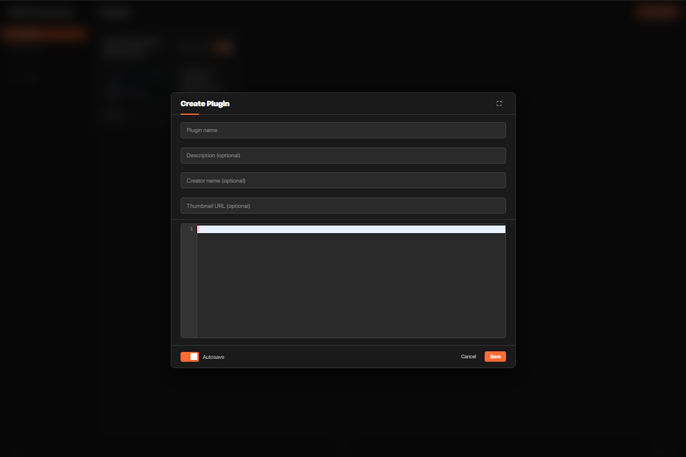
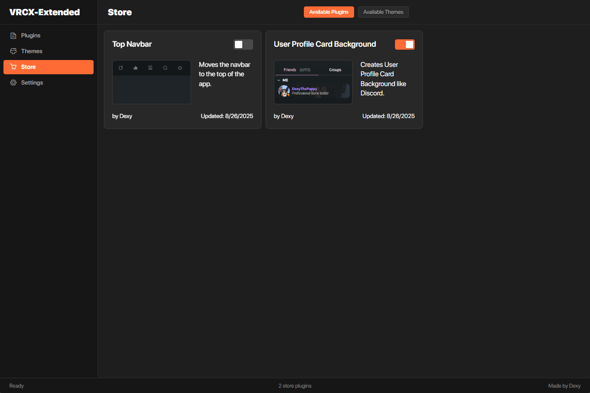
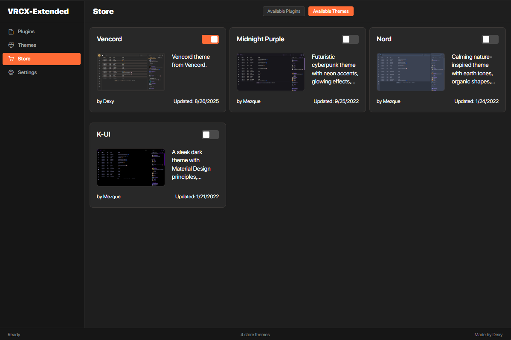

# VRCX-Extended

A modular extension system for VRCX that allows you to create and manage custom plugins and themes.

## Features

- **Plugin System**: Create and manage custom JavaScript plugins
- **Theme System**: Create and manage custom CSS themes
- **Online Store**: Use premade Themes/Plugins from this repo in the app

## Screenshots

| Editor | Store Plugins | Store Themes |
|--------------|---------------|--------------|
| <br>*Create and edit plugins and themes with the built-in editor* | <br>*Browse and manage available plugins* | <br>*Browse and manage available themes* |

## Installation

1. Press ```Win+R``` then type in ```%appdata%/VRCX```
2. Download the ```custom.js``` file and add it to the directory.
3. Open VRCX and look for the VRCX-Extended Button in the Navigation Bar.

## Usage

1. Click the VRCX-Extended menu item in VRCX
2. Use the popup window to manage plugins and themes
3. Create new plugins or themes using the built-in editor or use the store

## Development

For development and testing:

1. Enable debug mode in settings
2. Set up local file paths as described above
3. Make changes to your local files
4. Refresh VRCX to see changes immediately

## Debug Mode

VRCX-Extended includes a debug mode that allows you to load modules from local file paths instead of GitHub. This is useful for development and testing.

### Enabling Debug Mode

1. Open VRCX-Extended settings (click the VRCX-Extended menu item in VRCX)
2. Go to the "Settings" tab
3. Check "Enable debug mode (load from local files)"
4. Place files from repo to ```C:\Program Files\VRCX\html\extended```.
4. Refresh the page
5. Logs should confirm the path that is has been loaded locally instead of using github.

## License

This project is open source and available under the MIT License.
